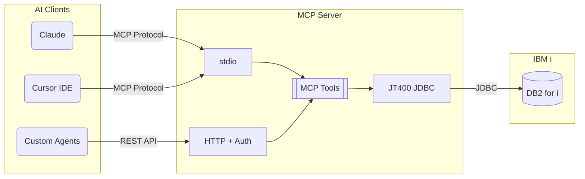

# mcp-server-db2i

[](https://github.com/Strom-Capital/mcp-server-db2i/actions/workflows/ci.yml)
[](https://www.npmjs.com/package/mcp-server-db2i)
[](https://opensource.org/licenses/MIT)
[](https://modelcontextprotocol.io/)
[](https://www.ibm.com/products/ibm-i)
[](https://www.typescriptlang.org/)
[](https://nodejs.org/)
[](docs/docker.md)
[](https://www.npmjs.com/package/mcp-server-db2i)
[](https://github.com/Strom-Capital/mcp-server-db2i/pulls)
[](https://github.com/Strom-Capital/mcp-server-db2i/commits/main)

A [Model Context Protocol (MCP)](https://modelcontextprotocol.io/) server for IBM DB2 for i (DB2i). This server enables AI assistants like Claude and Cursor to query and inspect IBM i databases using the JT400 JDBC driver.

## Architecture

AI clients connect to the MCP Server via stdio (IDEs) or HTTP (agents), which executes read-only queries against DB2 for i using the JT400 JDBC driver.



## Features

- **Read-only SQL queries** - Execute SELECT statements safely with automatic result limiting
- **Schema inspection** - List all schemas/libraries with optional filtering
- **Table metadata** - List tables, describe columns, view indexes and constraints
- **View inspection** - List and explore database views
- **Secure by design** - Only SELECT queries allowed, credentials via environment variables
- **Docker support** - Run as a container for easy deployment
- **HTTP Transport** - REST API with token authentication for web/agent integration
- **Dual Transport** - Run stdio and HTTP simultaneously

## Quick Start

### Installation

```bash
npm install -g mcp-server-db2i
```

Or with Docker:

```bash
docker build -t mcp-server-db2i .
```

### Configuration

Create a `.env` file with your IBM i credentials:

```env
DB2I_HOSTNAME=your-ibm-i-host.com
DB2I_USERNAME=your-username
DB2I_PASSWORD=your-password
DB2I_SCHEMA=your-default-schema  # Optional
```

### Cursor Setup

Add to `~/.cursor/mcp.json`:

```json
{
  "mcpServers": {
    "db2i": {
      "command": "npx",
      "args": ["mcp-server-db2i"],
      "env": {
        "DB2I_HOSTNAME": "your-host",
        "DB2I_USERNAME": "your-user",
        "DB2I_PASSWORD": "your-password"
      }
    }
  }
}
```

See the [Client Setup Guide](docs/client-setup.md) for more options including Docker setup.

## Available Tools

| Tool | Description |
|------|-------------|
| `execute_query` | Execute read-only SELECT queries |
| `list_schemas` | List schemas/libraries (with optional filter) |
| `list_tables` | List tables in a schema (with optional filter) |
| `describe_table` | Get detailed column information |
| `list_views` | List views in a schema (with optional filter) |
| `list_indexes` | List SQL indexes for a table |
| `get_table_constraints` | Get primary keys, foreign keys, unique constraints |

### Filter Syntax

The list tools support pattern matching:
- `CUST` - Contains "CUST"
- `CUST*` - Starts with "CUST"
- `*LOG` - Ends with "LOG"

## Example Usage

Once connected, you can ask the AI assistant:

- "List all schemas that contain 'PROD'"
- "Show me the tables in schema MYLIB"
- "Describe the columns in MYLIB/CUSTOMERS"
- "What indexes exist on the ORDERS table?"
- "Run this query: SELECT * FROM MYLIB.CUSTOMERS WHERE STATUS = 'A'"

## Documentation

| Guide | Description |
|-------|-------------|
| [HTTP Transport](docs/http-transport.md) | REST API with token authentication |
| [Configuration](docs/configuration.md) | All environment variables and JDBC options |
| [Security](docs/security.md) | Credentials, rate limiting, query validation |
| [Client Setup](docs/client-setup.md) | Cursor, Claude, Claude Code setup |
| [Docker Guide](docs/docker.md) | Container deployment |
| [Development](docs/development.md) | Contributing and local setup |

## Compatibility

- IBM i V7R3 and later (V7R5 recommended)
- Node.js 20.6 or higher
- Java Runtime Environment (JRE) 11 or higher

## Related Projects

- **[IBM ibmi-mcp-server](https://github.com/IBM/ibmi-mcp-server)** - IBM's official MCP server for IBM i systems. Offers YAML-based SQL tool definitions and AI agent frameworks. Requires [Mapepire](https://mapepire-ibmi.github.io/).

## Contributing

Contributions are welcome! See the [Development Guide](docs/development.md) for setup instructions.

## License

MIT License - see [LICENSE](LICENSE) for details.

## Acknowledgments

- [node-jt400](https://www.npmjs.com/package/node-jt400) - JT400 JDBC driver wrapper for Node.js
- [Model Context Protocol](https://modelcontextprotocol.io/) - The protocol specification
- [@modelcontextprotocol/sdk](https://github.com/modelcontextprotocol/typescript-sdk) - Official TypeScript SDK
