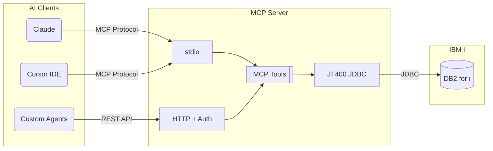

# Documentation

Welcome to the mcp-server-db2i documentation. This guide provides detailed information for configuring, deploying, and developing with the IBM DB2 for i MCP server.

## Quick Links

| Guide | Description |
|-------|-------------|
| [HTTP Transport](http-transport.md) | REST API with token authentication for web/agent integration |
| [Configuration](configuration.md) | Environment variables, JDBC options, and all settings |
| [Security](security.md) | Credentials management, rate limiting, and query validation |
| [Client Setup](client-setup.md) | Setup for Cursor, Claude Desktop, and Claude Code |
| [Docker Guide](docker.md) | Container deployment with Docker and docker-compose |
| [Development](development.md) | Contributing, testing, and local development setup |

## Overview

mcp-server-db2i is a [Model Context Protocol (MCP)](https://modelcontextprotocol.io/) server that enables AI assistants to query and inspect IBM DB2 for i databases. It supports two transport modes:

- **stdio** (default) - For CLI and IDE integration (Cursor, Claude)
- **HTTP** - REST API with token authentication for web applications and agents

## Architecture

## Available Tools

| Tool | Description |
|------|-------------|
| `execute_query` | Execute read-only SELECT queries |
| `list_schemas` | List schemas/libraries (with optional filter) |
| `list_tables` | List tables in a schema (with optional filter) |
| `describe_table` | Get detailed column information |
| `list_views` | List views in a schema (with optional filter) |
| `list_indexes` | List SQL indexes for a table |
| `get_table_constraints` | Get primary keys, foreign keys, unique constraints |

> **Note:** `list_indexes` and `get_table_constraints` query the `QSYS2` SQL catalog views and only return SQL-defined objects. Legacy DDS Logical Files and Physical File constraints are not included.

## Filter Syntax

The list tools support pattern matching:

| Pattern | Matches |
|---------|---------|
| `CUST` | Contains "CUST" |
| `CUST*` | Starts with "CUST" |
| `*LOG` | Ends with "LOG" |
| `ORD*FILE` | Starts with "ORD", ends with "FILE" |

## Compatibility

- IBM i V7R3 and later (V7R5 recommended)
- Node.js 20.6 or higher
- Java Runtime Environment (JRE) 11 or higher (for JDBC)

## Related Projects

- **[IBM ibmi-mcp-server](https://github.com/IBM/ibmi-mcp-server)** - IBM's official MCP server for IBM i systems
- **[node-jt400](https://www.npmjs.com/package/node-jt400)** - JT400 JDBC driver wrapper for Node.js
- **[Model Context Protocol](https://modelcontextprotocol.io/)** - The protocol specification
