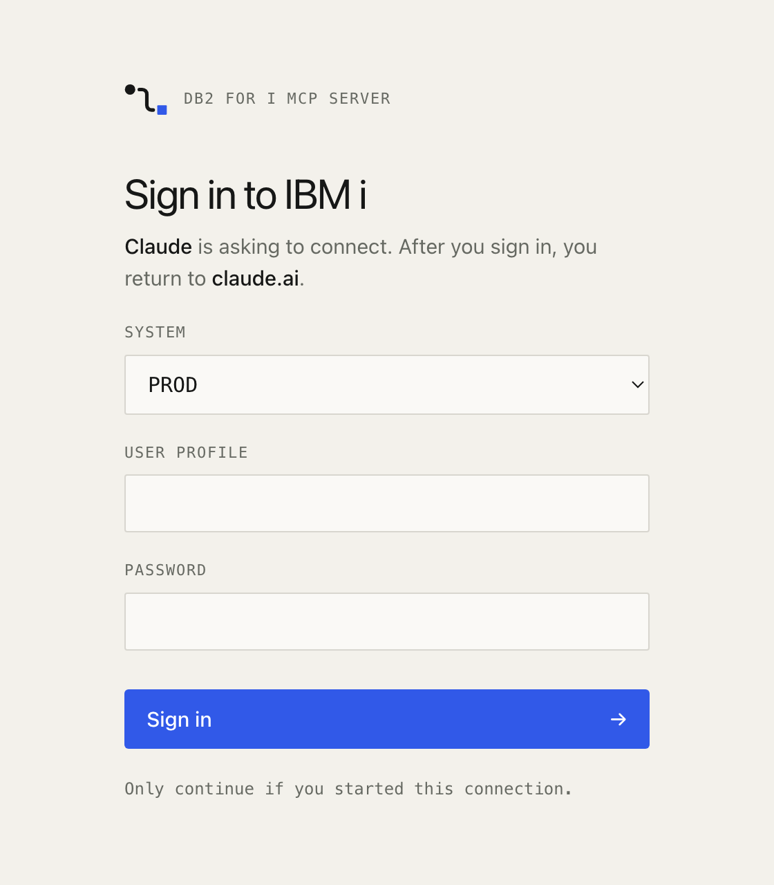
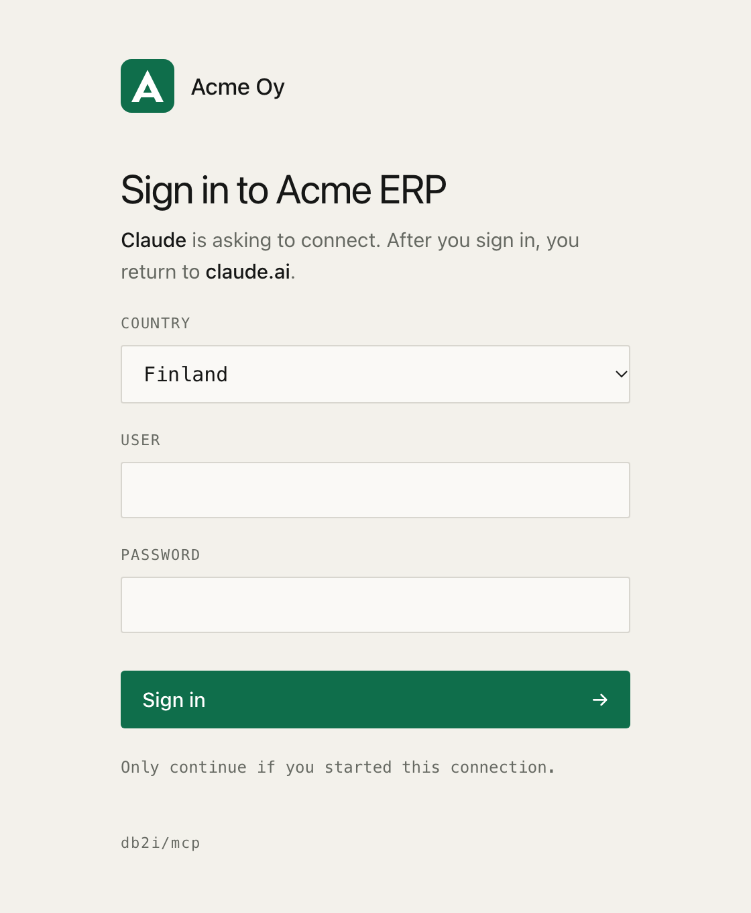

With [OAuth](http-transport.md#remote-clients-oauth), your users see this server's sign-in page when they connect from claude.ai, Claude for Excel or another client. The page asks for their IBM i password. People trust it more when they recognize their own company on it, and when it speaks their language.

Every setting on this page is optional and read at startup. Unset, the page looks as it does by default. An invalid value, such as a logo that is too large, stops the server with a message that names the setting.

<p align="center">
  <picture>
    <source media="(prefers-color-scheme: dark)" srcset="assets/oauth-sign-in-dark.png" />
    
  </picture>
  <picture>
    <source media="(prefers-color-scheme: dark)" srcset="assets/oauth-sign-in-custom-dark.png" />
    
  </picture>
</p>

## Name, logo and colors

```bash
MCP_OAUTH_BRAND_NAME="Acme Oy"
MCP_OAUTH_LOGO=/config/logo.svg
MCP_OAUTH_TITLE="Sign in to Acme ERP"
MCP_OAUTH_SYSTEM_LABEL=Country
MCP_OAUTH_ACCENT="#0F6E4B"
MCP_OAUTH_ACCENT_DARK="#5FD3A0"
```

| Variable | Example | What it changes |
|---|---|---|
| `MCP_OAUTH_BRAND_NAME` | `Acme Oy` | The name in the header, next to the logo or on its own, and in the browser tab title. Up to 60 characters |
| `MCP_OAUTH_LOGO` | `/config/logo.svg` | The logo in the header, in place of the db2i/mcp logo. SVG or PNG, at most 64 KB, shown at most 40 px high |
| `MCP_OAUTH_TITLE` | `Sign in to Acme ERP` | The page heading, in place of "Sign in to IBM i". Up to 80 characters |
| `MCP_OAUTH_SYSTEM_LABEL` | `Country` | The label above the system picker, in place of "System". Up to 40 characters |
| `MCP_OAUTH_ACCENT` | `#0F6E4B` | Button and focus color in light mode. `#RGB` or `#RRGGBB` |
| `MCP_OAUTH_ACCENT_DARK` | `#5FD3A0` | The same in dark mode. Defaults to `MCP_OAUTH_ACCENT` |

- **The logo is inlined.** The file is read once at startup and embedded in the page, so the page loads nothing from another site and its Content Security Policy stays the same.
- **SVG logos must be plain drawings.** A logo with a script, an event attribute such as `onload`, `foreignObject`, a DOCTYPE, or a reference to another file or URL is refused. References inside the file, such as `url(#gradient)`, are fine. If your logo is refused, export it again as a plain SVG, or use a PNG.
- **The button text stays readable.** The server picks white or black text, whichever has more contrast with your accent. If the accent itself is hard to see against the page background, startup logs a warning.
- **A small credit stays.** When you set a name or a logo, a "db2i/mcp" line appears at the bottom of the page, so your IT team can tell what software is behind it.

### System names in the picker

With [several systems](configuration.md#multiple-systems), the page shows a picker. Give a profile a `label` to show a friendlier name. The profile `name` is still the value the form submits, and what the audit log and tools see.

```yaml
profiles:
  - name: fi
    label: Finland
    host: ibmi.example.com
    # ...
  - name: se
    label: Sweden
    host: ibmi.example.com
    # ...
```

## Fonts

| Variable | Example | What it changes |
|---|---|---|
| `MCP_OAUTH_FONT_FAMILY` | `"Inter", system-ui, sans-serif` | The CSS font stack for the page text. The fonts must already be installed on the reader's device |
| `MCP_OAUTH_FONT_FILE` | `/config/brand.woff2` | A font file for the page text, inlined so it works on any device. WOFF2 only, at most 200 KB |

With both set, the font file comes first and the stack is the fallback. The stack may contain font names, quotes and commas only. Labels and input fields keep the monospace font.

Setting `MCP_OAUTH_FONT_FILE` adds `font-src data:` to the page's Content Security Policy. It is the only change the branding settings make to it.

## Language and wording

The page ships in English and Finnish.

| Variable | Example | What it does |
|---|---|---|
| `MCP_OAUTH_LANGUAGE` | `fi` | The page language. `en` by default. `auto` picks the best match for the browser's language among the available ones, and falls back to English |
| `MCP_OAUTH_STRINGS` | `/config/sign-in.json` | A JSON file that changes any string, or adds a language the server doesn't ship |

Everything the page shows is translated: the heading, the intro line, the labels, the button, the note, and the errors. `<html lang>` follows the language. Error codes that clients read, in OAuth redirects and JSON responses, stay in English as the OAuth specification expects.

A strings file maps language codes to the strings you want to change. Keys you leave out keep the built-in text, and a language the server doesn't ship falls back to English for them.

```json
{
  "fi": {
    "systemLabel": "Yritys"
  },
  "sv": {
    "heading": "Logga in på IBM i",
    "intro": "{client} vill ansluta. När du har loggat in återvänder du till {returnTo}.",
    "systemLabel": "System",
    "userLabel": "Användarnamn",
    "passwordLabel": "Lösenord",
    "submit": "Logga in"
  }
}
```

With this file, `MCP_OAUTH_LANGUAGE=sv` shows the Swedish page, and `auto` offers English, Finnish and Swedish.

`MCP_OAUTH_TITLE` and `MCP_OAUTH_SYSTEM_LABEL` set the heading and picker label for every language. A strings file entry for one language takes precedence over them, so you can give the Finnish page its own heading.

### Keys

| Key | English text |
|---|---|
| `heading` | Sign in to IBM i |
| `intro` | {client} is asking to connect. After you sign in, you return to {returnTo}. |
| `systemLabel` | System |
| `userLabel` | User |
| `passwordLabel` | Password |
| `submit` | Sign in |
| `note` | Only continue if you started this connection. |
| `signedInHeading` | Signed in |
| `returning` | Returning to {host}. |
| `continueLine` | {link} if nothing happens. |
| `continueLink` | Continue |
| `errorHeading` | Sign-in error |
| `errorUnknownClient` | This client is not registered with this server. Remove the connector and add it again. |
| `errorRedirectUri` | The redirect URI is not registered for this client. |
| `errorExpired` | This sign-in page has expired. Start the connection again from your client. |
| `errorClientNotAllowed` | This client is no longer allowed. Remove the connector and add it again. |
| `errorMissingFields` | Enter your user and password. |
| `errorRateLimited` | Too many sign-in attempts. Try again in {seconds} seconds. |
| `errorCredentials` | Sign-in failed. Check the user and password. |
| `errorSystem` | This system cannot be used to sign in. Ask your administrator. |
| `errorBusy` | Too many sign-ins are in progress. Try again shortly. |
| `errorUnexpected` | Sign-in failed unexpectedly. Try again. |

The full English and Finnish files are in [`src/auth/locales`](https://github.com/Strom-Capital/mcp-server-db2i/tree/main/src/auth/locales).

Rules for a strings file:

- **Strings are text, not HTML.** Every string is escaped, so `<b>` shows as it is written.
- **Keep the placeholders.** A string must use exactly the `{placeholders}` of its English text. The server fills them with the client name, the site the user returns to, or a number. It refuses a string that drops or adds one, so a translation can't hide where the user is sent.
- **Limits.** Each string is at most 200 characters, and the file at most 64 KB. A file that is not valid JSON, or has an unknown key or language code, stops the server at startup.

A new built-in language is one JSON file in `src/auth/locales` with every key, added to `signInStrings.ts`. A test fails if it misses a key or a placeholder. Contributions are welcome.

## In Docker

Mount the files read-only and point the variables at them:

```yaml
services:
  db2i-mcp:
    environment:
      - MCP_OAUTH_BRAND_NAME=Acme Oy
      - MCP_OAUTH_LOGO=/config/logo.svg
      - MCP_OAUTH_ACCENT=#0F6E4B
      - MCP_OAUTH_LANGUAGE=auto
      - MCP_OAUTH_STRINGS=/config/sign-in.json
    volumes:
      - ./branding:/config:ro
```
