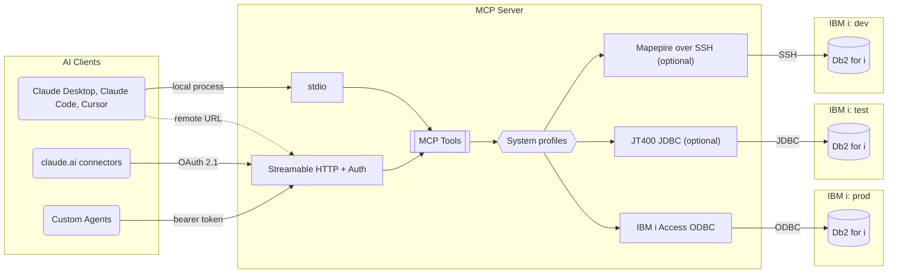

mcp-server-db2i gives Claude, Cursor, and other MCP clients read-only access to Db2 for i. The assistant can list libraries, describe tables, find columns across the catalog, check journaling, and run SELECT statements that the server validates first.

It connects through the IBM i Access ODBC driver by default. It can also use the JT400 JDBC driver, or Mapepire over SSH when only SSH reaches the IBM i. The server is listed in the [MCP Registry](https://registry.modelcontextprotocol.io/) as `io.github.Strom-Capital/mcp-server-db2i`.

<Columns cols={2}>
  <Card title="Quickstart" icon="rocket" href="/quickstart">
    Install the server, set credentials, and connect a client.
  </Card>
  <Card title="Tools" icon="wrench" href="/tools">
    The built-in tools, resources, and prompts.
  </Card>
  <Card title="Configuration" icon="sliders" href="/configuration">
    Environment variables, drivers, and multiple systems.
  </Card>
  <Card title="Remote clients" icon="globe" href="/http-transport">
    Streamable HTTP with OAuth 2.1 for claude.ai connectors, or bearer tokens for agents.
  </Card>
</Columns>

## Architecture

Local clients such as Claude Desktop, Claude Code, and Cursor start the server as a process and talk over stdio. Remote clients connect over Streamable HTTP at `/mcp`, signing in with OAuth 2.1 (claude.ai custom connectors) or a bearer token (custom agents). One server can reach several IBM i systems through connection profiles, each with its own driver.

## Features

- **Read-only SQL.** SELECT and WITH only, checked by a SQL parser and by `QSYS2.PARSE_STATEMENT`, with a row limit and a query timeout that cancels runaway statements on the IBM i. See [Query validation](/security#query-validation).
- **Catalog tools.** List schemas, tables, views, indexes, and constraints; describe columns; search tables and columns across libraries; return DDL; list dependent objects; check journaling; and profile a table.
- **Business SQL tools.** Load reviewed ERP queries and table notes from YAML, and check the files before the server starts. See [Business SQL tools](/custom-tools).
- **Multiple systems.** Reach production, test, and other partitions from one server with `DB2I_PROFILES`, each with its own driver, credentials, and library allowlist. See [Multiple systems](/configuration#multiple-systems).
- **Guardrails.** A library allowlist, per-tool enable and disable, column masking, rate limits, and a JSON audit log. See [Security](/security).
- **Remote access.** Streamable HTTP with built-in OAuth 2.1 sign-in against the user's own IBM i profile, so claude.ai custom connectors can connect. See [HTTP transport](/http-transport).
- **Current MCP spec.** Speaks 2026-07-28 and still serves stateless 2025-era clients.

## Compatibility

- IBM i V7R3 and later (V7R5 recommended)
- `validate_query` and the `execute_query` parse check need `QSYS2.PARSE_STATEMENT` (IBM i 7.3 with Db2 PTF group SF99703 level 3, or 7.4 and later)
- `get_related_objects` needs IBM i 7.3 Technology Refresh 9, IBM i 7.4 Technology Refresh 3, or a later release
- `get_journal_info` needs the journal columns of `QSYS2.OBJECT_STATISTICS` (IBM i 7.3 Technology Refresh 2 or later)
- `search_ibmi_services` needs `QSYS2.SERVICES_INFO`, which ships with the Db2 for i PTF group
- Node.js 22 or higher
- unixODBC with the IBM i Access ODBC Driver for the default `odbc` driver, a JDK at install time and a JRE 11 or higher at runtime for the optional `jt400` driver, or SSH access and Java 8 or higher on the IBM i for the optional `mapepire` driver (see [Database drivers](/configuration#database-drivers))

## Related projects

- [IBM ibmi-mcp-server](https://github.com/IBM/ibmi-mcp-server) is IBM's official MCP server for IBM i. It offers YAML-based SQL tool definitions and agent frameworks, and requires a [Mapepire](https://mapepire-ibmi.github.io/) server. This project's `mapepire` driver uses Mapepire's SSH mode, which needs no Mapepire server running on the IBM i.
